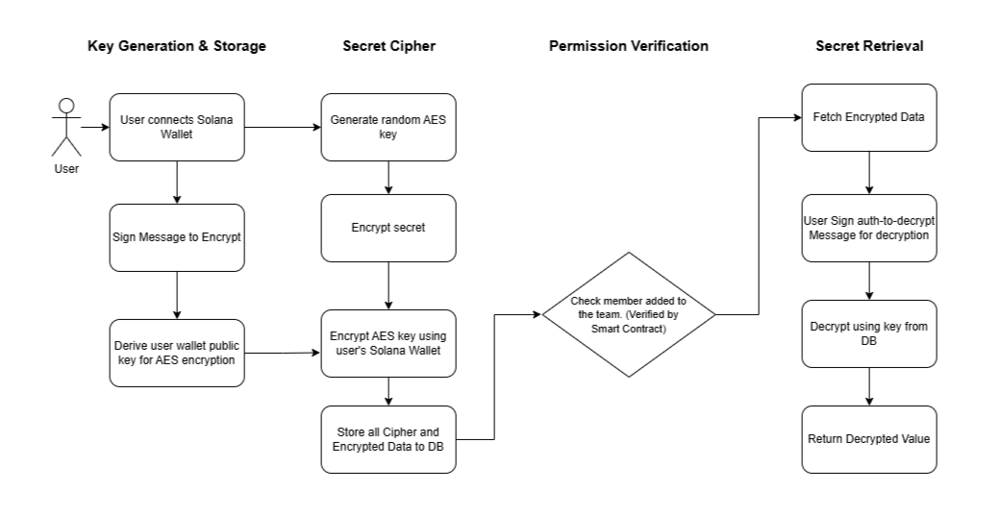

# SuiPass: Sui Blockchain-Powered Zero-Trust Secret Management with zkLogin & Walrus Storage

SuiPass revolutionizes secret management through zero key management - no private keys to store, no passwords to remember, no complex key rotations. Powered by Sui blockchain technology with zkLogin authentication, users can authenticate using OAuth providers while maintaining decentralized security. Walrus decentralized storage and Seal threshold encryption ensure enterprise-grade security for personal vaults and team collaboration.

**Zero-Trust Security Model**: Implements passwordless authentication where zkLogin provides seamless OAuth integration (Google, Facebook, Apple) while maintaining Sui wallet security. Zero key management means no private keys stored anywhere - encryption keys derived from Sui wallet signatures on-demand. Smart contract permissions provide on-chain membership verification ensuring only authorized users access secrets. End-to-end encryption with Walrus storage protects secrets before transmission - backend never sees plaintext data.

**Walrus & Seal Integration**: Utilizes Walrus decentralized storage for secure, distributed secret storage with built-in redundancy and censorship resistance. Seal threshold encryption enables secure team collaboration where secrets can be shared among development teams with cryptographic access control. Advanced encryption showcases including auto-encryption flows, credential upgrade systems, and real-time encryption status monitoring.

**AI-Powered Assistant**: Integrated AI Assistant provides smart project creation with guided optimal structure and environment setup, intelligent log analysis extracting insights from activity logs and access patterns, automated environment management with AI-suggested best practices for dev/staging/production workflows, and proactive security recommendations based on usage patterns and industry standards.

## Architecture Overview

SuiPass uses a modern, secure architecture built on Sui blockchain:


- **Frontend**: Next.js application with Sui wallet integration via @mysten/dapp-kit
- **Backend**: Express.js server with Supabase database
- **Smart Contract**: Sui Move programs for permission management
- **Authentication**: zkLogin for OAuth integration + Sui wallet signatures
- **Storage**: Walrus decentralized storage for encrypted secrets
- **Encryption**: Seal threshold encryption for team collaboration
- **Security**: End-to-end encryption using WebCrypto API + Walrus/Seal

### Security Model

1. **zkLogin Authentication**: Seamless OAuth login (Google, Facebook, Apple) with Sui wallet security
2. **Walrus Storage**: Decentralized storage ensuring data availability and censorship resistance
3. **Seal Encryption**: Threshold encryption enabling secure team collaboration
4. **End-to-End Encryption**: All secrets are encrypted in the browser before Walrus storage
5. **Sui-Based Permissions**: Access control managed through Sui Move smart contracts
6. **Zero Knowledge Design**: The backend never sees plaintext secrets

## Prerequisites

- Node.js >= 18.0.0
- pnpm (recommended) or npm
- A compatible Sui wallet (Sui Wallet, Phantom for Sui, etc.)
- Modern browser with WebCrypto support (Chrome, Firefox, Edge, Safari)
- OAuth provider account (Google, Facebook, Apple) for zkLogin

## Project Structure

```
suipass/
├── frontend/          # Next.js frontend application
│   ├── components/    # React components
│   │   ├── enhanced-secure-vault-showcase.tsx    # Advanced encryption demo
│   │   ├── credential-upgrade.tsx                # Credential migration system
│   │   ├── connect-wallet-button.tsx            # Sui wallet connection
│   │   └── personal-vault.tsx                   # Personal credential vault
│   ├── hooks/         # Custom React hooks for Sui integration
│   │   ├── use-secret-decryption.ts  # Secret decryption logic
│   │   ├── use-secret-encryption.ts  # Secret encryption logic
│   │   └── use-wallet-encryption.ts  # Sui wallet-based key management
│   ├── lib/           # Utility functions
│   │   ├── api.ts         # Backend API client
│   │   ├── crypto.ts      # WebCrypto + Walrus wrapper functions
│   │   ├── wallet-adapter.ts  # Sui wallet configuration
│   │   └── wallet-auth.ts # Sui wallet authentication + zkLogin
│   └── app/           # Next.js app directory
│       ├── dashboard/     # Main dashboard with personal vault
│       ├── auth/         # zkLogin authentication pages
│       └── login/        # Login flow with OAuth integration
│
├── backend/          # Express.js backend server
│   ├── lib/          # Backend utilities
│   │   ├── crypto.js     # Crypto operations (Walrus integration)
│   │   └── supabase.js   # Database connection
│   ├── routes/       # API routes
│   │   ├── secrets.js    # Secret management endpoints
│   │   ├── projects.js   # Project management endpoints
│   │   └── zklogin.js    # zkLogin authentication endpoints
│   └── index.js      # Server entry point
│
├── programs/         # Sui Move programs
│   └── permission_program/  # Permission management contract
│       ├── sources/        # Move source code
│       │   ├── permission.move  # Main permission contract
│       │   └── team_access.move # Team collaboration logic
│       └── Move.toml       # Move package configuration
```

## Quick Start (Development)

### 1. Frontend Setup

```powershell
cd frontend
pnpm install
```

Create a `.env.local` file in the frontend directory:

```env
NEXT_PUBLIC_API_URL=http://localhost:3002
NEXT_PUBLIC_SUI_NETWORK=testnet
NEXT_PUBLIC_WALRUS_PUBLISHER_URL=https://publisher.walrus-testnet.sui.io
NEXT_PUBLIC_WALRUS_AGGREGATOR_URL=https://aggregator.walrus-testnet.sui.io
```

Start the development server:

```powershell
pnpm dev
```

The frontend will be available at `http://localhost:3000`.

### 2. Backend Setup

```powershell
cd backend
pnpm install
```

Create a `.env` file in the backend directory:

```env
PORT=3002
SUPABASE_URL=your_supabase_url
SUPABASE_ANON_KEY=your_supabase_anon_key
SUPABASE_SERVICE_KEY=your_supabase_service_key
FRONTEND_URL=http://localhost:3000
SUI_NETWORK=testnet
WALRUS_CONFIG_FILE=./walrus-config.json
```

Start the backend server:

```powershell
pnpm dev
```

The backend API will be available at `http://localhost:3002`.

## Key Features

### 1. zkLogin Authentication

SuiPass uses zkLogin for seamless OAuth integration while maintaining Sui blockchain security:

- Connect using Google, Facebook, Apple, or other OAuth providers
- No need to install wallet browser extensions for basic usage
- Advanced users can connect Sui wallets for additional features
- Your OAuth identity is cryptographically linked to a Sui address
- Sign messages to verify your identity and derive encryption keys

### 2. Walrus Decentralized Storage

Secure, distributed storage built on Sui ecosystem:

- **Censorship Resistant**: No single point of failure or control
- **High Availability**: Built-in redundancy across multiple storage nodes
- **Cost Effective**: Pay-per-use model with competitive pricing
- **Fast Access**: Optimized for quick retrieval of encrypted secrets
- **Integration**: Native Sui blockchain integration for access control

### 3. Seal Threshold Encryption

Advanced cryptographic sharing for development teams:

- **Team Collaboration**: Share secrets securely among team members
- **Threshold Security**: Secrets can be reconstructed only with minimum threshold of members
- **Access Control**: Fine-grained permissions managed through Sui smart contracts
- **Automatic Revocation**: Remove team members instantly revokes their access
- **Audit Trail**: All access and sharing events recorded on-chain

### 4. Personal Vault System

Advanced credential management with multiple security tiers:

- **Basic Security**: Standard encryption for everyday credentials
- **Advanced Security**: Enhanced encryption with auto-upgrade flows
- **Credential Migration**: Seamless upgrade from basic to advanced security
- **Real-time Encryption**: Live encryption status and progress monitoring
- **Shield Protection**: Visual security indicators and upgrade prompts

### 5. On-Chain Permission Management

Access control managed through Sui Move smart contracts:

- Project owners can add/remove members on-chain
- Permission verification is decentralized and transparent
- Members can only decrypt secrets they have permission to access
- Automatic permission revocation when removed from project
- Support for multiple permission levels and roles

## Permission Program Flow

### 1. Project Initialization

1. Owner creates a new project on Sui blockchain
2. Move contract creates a shared object for the project
3. Owner becomes the default administrator with full permissions
4. Project configuration stored on-chain with access control rules

### 2. Team Member Management

1. Owner adds members to project through Sui Move contract
2. Each member's Sui address is stored in project state
3. Members can verify their access rights on-chain
4. Support for different permission levels (read, write, admin)
5. Owner can remove members, instantly revoking access across all services

### 3. Seal-Based Secret Sharing

1. When sharing a secret, the system verifies membership on-chain
2. Seal threshold encryption divides secrets among verified team members
3. Minimum threshold of members required to reconstruct secrets
4. Access is automatically revoked when removed from project
5. All permission checks are verified through the Sui Move contract

### 4. Walrus Storage Integration

1. Encrypted secrets are stored on Walrus decentralized storage
2. Storage blob IDs are recorded in Sui smart contract
3. Only verified team members can access storage blob IDs
4. Walrus ensures data availability and censorship resistance

## Encryption Flow

### 1. Key Derivation (zkLogin + Sui Wallet)

1. User authenticates via zkLogin (OAuth) or directly connects Sui wallet
2. User signs a message using their Sui address (derived from zkLogin or wallet)
3. The signature is used to derive an AES-256 encryption key using PBKDF2
4. This key is securely stored in browser localStorage for the session
5. Additional keys can be derived for team sharing using Seal encryption

### 2. Personal Vault Encryption

1. User creates credentials in their personal vault (browser-side)
2. Basic Security: Standard AES-256-GCM encryption with user-derived key
3. Advanced Security: Enhanced encryption with Walrus storage integration
4. Only the encrypted data, along with IV and metadata, is stored
5. Auto-upgrade flows help users migrate to advanced security

### 3. Team Secret Sharing (Seal Integration)

1. Project owner creates a team secret in the dashboard
2. Seal threshold encryption divides the secret among team members
3. Each member's share is encrypted with their individual key
4. Encrypted shares are stored on Walrus decentralized storage
5. Minimum threshold of members required to reconstruct the secret

### 4. Walrus Storage Process

1. Encrypted data is uploaded to Walrus publisher nodes
2. Walrus returns a blob ID for the stored data
3. Blob ID is recorded in Sui smart contract with access permissions
4. Only verified team members can retrieve the blob ID from contract
5. Members use blob ID to fetch encrypted data from Walrus aggregators

### 5. Secret Decryption & Access

1. User requests a secret through the application
2. System verifies permissions through Sui Move contract
3. If authorized, blob ID is provided to fetch encrypted data from Walrus
4. Frontend decrypts the data using user's derived key or reconstructs from Seal shares
5. Decrypted data never leaves the user's browser or is sent to backend


## Advanced Features

### Enhanced Security Showcase

- **Auto-Encryption Detection**: Automatic detection and upgrade of credentials to advanced security
- **Real-time Progress**: Live encryption status with progress indicators
- **Credential Migration**: Seamless upgrade flow from basic to advanced security
- **Visual Security Indicators**: Shield icons and security level badges
- **Walrus Integration Demo**: Live demonstration of decentralized storage

### Development Team Collaboration

- **Project Workspaces**: Organize secrets by development projects
- **Environment Management**: Separate dev, staging, and production secrets
- **Team Member Invitations**: Secure invitation system with on-chain verification
- **Role-Based Access**: Different permission levels for team members
- **Audit Logs**: Complete history of secret access and modifications

### zkLogin Integration Benefits

- **Seamless Onboarding**: No wallet installation required for new users
- **Familiar Authentication**: Use existing Google, Facebook, Apple accounts
- **Progressive Enhancement**: Start with OAuth, upgrade to full wallet features
- **Enterprise Ready**: Integration with corporate OAuth providers
- **Mobile Friendly**: Works on mobile devices without wallet apps

## Contributing

Contributions are welcome! Please submit a pull request with your changes.

## License

This project is licensed under the MIT License - see the LICENSE file for details.

## Acknowledgments

- **Sui Foundation** for the robust blockchain platform and Move programming language
- **Mysten Labs** for @mysten/dapp-kit, Walrus storage, and Seal encryption libraries
- **Supabase** for the excellent database and authentication infrastructure
- **Next.js** and **React** teams for the outstanding frontend framework
